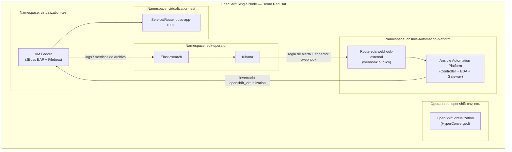

# EDA + JBoss Heap Space (demo)

Repositorio de demostración que provisiona en **OpenShift** (idealmente un clúster **Single Node** desde el aprovisionador **Demo Red Hat**): **Ansible Automation Platform (AAP)** con **EDA**, **OpenShift Virtualization** con una VM **Fedora** ejecutando **JBoss EAP**, **Elastic Cloud on Kubernetes (ECK)** con **Elasticsearch/Kibana**, y la integración **Kibana → webhook → EDA rulebook** ante eventos de memoria en los logs.

---

## Entorno de laboratorio: Demo Red Hat

Para reproducir la demo se recomienda usar el aprovisionador de entornos **Demo Red Hat** y el componente **OpenShift Single Node Cluster** disponible en ese catálogo (clúster OpenShift compacto en un solo nodo). Ese clúster es el destino donde corre el playbook: API de OpenShift, operadores y cargas de trabajo comparten un único nodo, por lo que los recursos (CPU/memoria) deben dimensionarse con margen. Referencia técnica de SNO en la documentación de producto: [Installing on a single node](https://docs.redhat.com/en/documentation/openshift_container_platform/latest/html/installing_on_a_single_node/).

Tras el aprovisionamiento, anotad:

- URL de la API (por ejemplo `https://api.<cluster>.<dominio>:6443`)
- Usuario y contraseña de administrador del clúster
- Dominio de aplicaciones (para construir los FQDN de rutas de AAP, Kibana, etc.)

---

## Topología de la demo

El flujo funcional es: **logs de JBoss/Filebeat → Elasticsearch → regla en Kibana → webhook HTTP → activación EDA en AAP → job template** (por ejemplo remediación vía inventario OpenShift Virtualization).



**Resumen de componentes**

| Pieza | Dónde vive | Rol en la demo |
|--------|------------|----------------|
| AAP Operator + instancia `example` | `ansible-automation-platform` | Controller, EDA, licencia, proyectos Git, credenciales, job template, activación de rulebook |
| OpenShift Virtualization + HyperConverged | `openshift-cnv` / clúster | Ejecución de la VM |
| VM Fedora + JBoss | `virtualization-test` | App de prueba, heap dumps, `curl` en OOM hacia el webhook EDA |
| ECK (Elasticsearch + Kibana) | `eck-operator` | Ingesta de logs (Filebeat) y alertas hacia el webhook |
| Objetos JBoss en OpenShift | `virtualization-test` | Exponer la aplicación vía Route (según `jboss-openshift-objects.yaml`) |

---

## Requisitos previos (máquina desde la que ejecutáis Ansible)

- **Ansible** y colecciones usadas por el playbook, entre otras: `kubernetes.core`, `ansible.controller`, `ansible.eda` (y dependencias que indique vuestro `requirements.yml` si lo usáis).
- **`oc`** (OpenShift CLI), con acceso de red al API del clúster.
- **`virtctl`** (KubeVirt), para el `ProxyCommand` del inventario SSH hacia la VM.
- Archivos locales que el playbook **no** crea y asume en rutas concretas (ver siguiente sección).

---

## Artefactos locales obligatorios

Estos ficheros deben existir **antes** o **durante** la ejecución; si faltan, fallarán tareas concretas:

| Artefacto | Uso en el playbook |
|-----------|-------------------|
| `../manifest_AAP2.6_20260303T154318Z.zip` | Licencia de AAP (`ansible.controller.license`). La ruta es relativa al directorio de trabajo de Ansible (un nivel por encima del repo). **Sustituid por vuestro manifiesto válido.** |
| `ssh_tests_connections/id_fedora_new` | Clave SSH para credencial *Machine* en Controller y para el inventario hacia la VM. Debe coincidir con la clave pública configurada en la VM (secret en `openshift-virtualization-machine-fedora.yaml`). |
| `../jboss-eap-8.1.0-dev.zip` | Despliegue de JBoss EAP en la VM Fedora (origen en el control node, `remote_src: no`). |
| `crash.war`, `jboss-eap.service` | Despliegue y servicio systemd de JBoss en la VM. |
| Manifiestos en el repo referenciados por `src:` | Por ejemplo `automation-platform-install-operator.yaml`, `automation-platform-install-ansible-automation-platform.yaml`, `openshift-virtualization.yaml`, `openshift-virtualization-hyper-converged.yaml`, `openshift-virtualization-machine-fedora.yaml`, `eda-rulebook-activayion-route.yaml`, `eck-install-operator.yaml`, `eck-instances-operator.yaml`, `jboss-openshift-objects.yaml`, plantilla `kibana_rule.json`. |

**Credenciales embebidas en tareas:** el playbook incluye valores de ejemplo (registry, usuario de registry, contraseñas). En entornos reales debéis **sustituirlos** por variables o Ansible Vault y no versionar secretos.

---

## Variables (`vars` del playbook)

Definidas en `playbook-install-initial.yaml`; todas se utilizan en algún punto. Para un despliegue nuevo **debéis ajustarlas** a vuestro clúster Demo Red Hat (API, rutas y credenciales).

| Variable | Obligatorio / notas | Uso |
|----------|---------------------|-----|
| `crc_url_api_client` | **Sí** (URL real del API) | API de OpenShift (`oc login`, `kubernetes.core.*`). El nombre histórico `crc_*` se mantiene en el playbook. |
| `crc_user` | **Sí** | Usuario con permisos para instalar operadores, namespaces y recursos usados. |
| `crc_password` | **Sí** | Contraseña del usuario anterior. |
| `crc_validate_certs` | Recomendado (`false` en labs con certificados no estándar) | Validación TLS en módulos `kubernetes.core` y `uri`. |
| `awx_host` | **Sí** | FQDN del **Gateway/AAP** (sin `https://`) para API `https://{{ awx_host }}/...`. Debe coincidir con la ruta que expone vuestra instancia AAP tras instalar el operador. |
| `awx_user` | **Sí** | Usuario admin (o equivalente) para obtener token OAuth vía API Gateway. |
| `awx_password` | **Sí** | Contraseña del usuario AAP. |
| `kibana_host` | **Sí** | Hostname de la ruta HTTPS de Kibana (sin esquema), alineado con el `Kibana` de ECK y rutas del clúster. |
| `kibana_user` | **Sí** | Usuario para Kibana/API (en el playbook se usa `elastic`). |
| `elastic_host` | **Sí** | Hostname de Elasticsearch expuesto (ruta OpenShift), usado por Filebeat en la VM. |

**Variables derivadas en runtime (no hace falta definirlas a mano):** token de OpenShift (`oc whoami --show-token`), `aap_token`, `elastic_password` (desde secret `elasticsearch-poc-es-elastic-user`), `end_point_eda_rulebook`, `connector_id`, etc.

**Coherencia con el inventario:** el segundo play del libro usa `hosts: fedora-chocolate-smelt-74`. Ese nombre debe existir en el inventario y coincidir con el nombre de la **VirtualMachine** en `openshift-virtualization-machine-fedora.yaml`. Si renombráis la VM, actualizad inventario **y** la tarea `delegate_to: fedora-chocolate-smelt-74` del primer play.

---

## Fases del playbook `playbook-install-initial.yaml`

### Play 1 — `localhost`: instalación en OpenShift y configuración de AAP/EDA

1. **Preparación:** copia de variables en facts; `oc login`; obtención de token.
2. **AAP:** aplicar manifiesto del operador; esperar CSV en `Succeeded`; aplicar instancia `AnsibleAutomationPlatform`; esperar API (`/api/controller/v2/config/` con 401); obtener token OAuth; **subir licencia** desde el ZIP.
3. **OpenShift Virtualization:** Subscription/operador; esperar CSV; aplicar `HyperConverged`; esperar salud `healthy`.
4. **VM Fedora:** crear VM desde manifiesto; esperar estado `Running`; pausa breve.
5. **EDA / Controller:** credenciales (registry, AAP), decision environment, proyecto Git Controller, proyecto EDA, credencial máquina Fedora, credencial OpenShift (Bearer), inventario + fuente `openshift_virtualization`, actualización de fuente, job template `JBoss HelloWorld - OOM Reaction`, activación del rulebook, Route `eda-rulebook-activayion-route.yaml`; lectura de host del webhook.
6. **ECK:** instalar operador; esperar CSV; instalar instancias; leer password de `elastic`; esperar Kibana HTTP 200.
7. **Facts en la VM (delegate):** asigna `end_point_eda_rulebook`, usuario Kibana y password elastic en el host `fedora-chocolate-smelt-74` para el play siguiente.

### Play 2 — `fedora-chocolate-smelt-74`: preparar JBoss y Filebeat

- Liberar puerto local 2222 desde localhost (tarea delegada).
- Repositorio Yum de Elastic; paquetes `java-21-openjdk-devel`, `unzip`, `filebeat`.
- Descomprimir JBoss si no existe; unit `jboss-eap.service`; directorio de dumps; `JAVA_OPTS` con `OnOutOfMemoryError` hacia `{{ end_point_eda_rulebook }}`.
- Despliegue `crash.war`; reinicio de servicios; `filebeat.yml` apuntando a `https://{{ elastic_host }}:443` con usuario/contraseña elastic.

### Play 3 — `localhost`: exponer JBoss y reglas en Kibana

- `oc login` de nuevo; token.
- Aplicar `jboss-openshift-objects.yaml`; mostrar URL de `jboss-app-route`.
- Crear conector webhook en Kibana, prueba de ejecución y regla de alerta usando la plantilla `kibana_rule.json`.

---

## Cómo ejecutar

Desde la raíz del repositorio (o fijando `ansible.cfg` / `-e` según vuestra organización):

```bash
ansible-playbook -i inventory playbook-install-initial.yaml
```

Para **sobrescribir variables** sin editar el YAML (recomendado para secretos y URLs del taller):

```bash
ansible-playbook -i inventory playbook-install-initial.yaml \
  -e crc_url_api_client='https://api....:6443' \
  -e crc_user='admin' \
  -e crc_password='...' \
  -e awx_host='example-ansible-automation-platform.apps....' \
  -e awx_user='admin' \
  -e awx_password='...' \
  -e kibana_host='kibana-poc-....apps....' \
  -e elastic_host='elasticsearch-poc-....apps....'
```

El inventario `inventory` define cómo Ansible alcanza la VM por SSH (típicamente `virtctl port-forward` al VMI en el namespace `virtualization-test`).

---

## Comandos y referencias útiles (desarrollo / prueba manual)

Compilación y prueba de OOM en JVM aislada (ajustad la URL del webhook):

```bash
javac HeapClasher.java

java -Xmx128M \
  -XX:OnOutOfMemoryError='curl -H "Content-Type: application/json" -X POST -d "{\"status\":\"OutOfMemory\",\"host\":\"$(hostname)\"}" http://<IP_DE_TU_EDA>:5000/endpoint' \
  HeapClasher
```

SSH a la VM (ejemplos; adaptad clúster y clave):

```bash
ssh-keygen -f "$HOME/.ssh/known_hosts" -R "[127.0.0.1]:30022"
ssh fedora@127.0.0.1 -p 30022

virtctl -n virtualization-test ssh fedora@fedora-chocolate-smelt-74 --identity-file=<path_to_sshkey>
```

Catálogo de imágenes (decision environment de ejemplo en el playbook):

- [Buscar contenedores AAP en catalog.redhat.com](https://catalog.redhat.com/en/search?searchType=Containers&build_categories_list=Automation+execution+environment)
- [de-supported-rhel9](http://catalog.redhat.com/en/software/containers/ansible-automation-platform-26/de-supported-rhel9/66fed7b3b603033a6460028a)

Ejemplo de `curl` al webhook EDA (sustituid la ruta por la de vuestra Route):

```bash
curl -H "Content-Type: application/json" -X POST \
  http://eda-webhook-external-ansible-automation-platform.apps.<cluster>.<dominio>/ \
  -d '{"status": "OutOfMemory","host": "jboss-prod-01", "message": "Heap space error detected in logs"}'
```

---

## Notas

- El playbook está pensado para ejecutarse desde **Ansible Automation Platform / AWX** o desde CLI; el comentario en el YAML indica uso desde AAP/AWX.
- Revisad que las **rutas** `awx_host`, `kibana_host` y `elastic_host` correspondan a las **Routes** reales creadas por los operadores en vuestro Single Node; si el nombre del clúster cambia, deben actualizarse las variables.
- Tras cambiar el nombre de la VM Fedora, mantened alineados: manifiesto KubeVirt, `inventory`, `delegate_to` y etiquetas que uséis en las reglas de Kibana.
